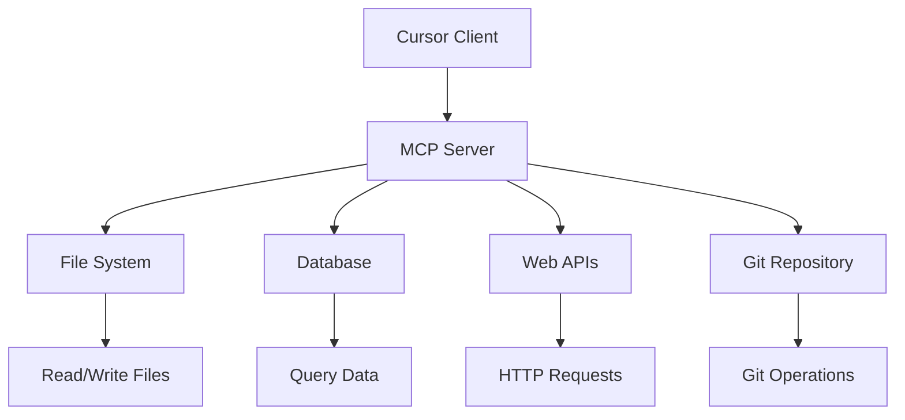

---
# You can also start simply with 'default'
theme: seriph
# random image from a curated Unsplash collection by Anthony
# like them? see https://unsplash.com/collections/94734566/slidev
background: https://images.unsplash.com/photo-1555066931-4365d14bab8c?ixlib=rb-4.0.3&auto=format&fit=crop&w=2070&q=80
# some information about your slides (markdown enabled)
title: Cursor 使用指南
info: |
  ## Cursor 使用指南
  提升开发效率的AI编程助手完整指南
  
  涵盖配置、索引、规则、提示工程、MCP和Git集成
# apply unocss classes to the current slide
class: text-center
# https://sli.dev/features/drawing
drawings:
  persist: false
# slide transition: https://sli.dev/guide/animations.html#slide-transitions
transition: slide-left
# enable MDC Syntax: https://sli.dev/features/mdc
mdc: true
# open graph
# seoMeta:
#  ogImage: https://cover.sli.dev
---

# Cursor Vibe coding

<div class="pt-12">
  <span @click="$slidev.nav.next" class="px-2 py-1 rounded cursor-pointer" hover:bg="white hover:bg-opacity-10">
    开始探索 <carbon:arrow-right class="inline"/>
  </span>
</div>

<div class="abs-br m-6 flex gap-2">
  <button @click="$slidev.nav.openInEditor()" title="在编辑器中打开" class="text-xl slidev-icon-btn opacity-50 !border-none !hover:text-white">
    <carbon:edit />
  </button>
  <a href="https://github.com/getcursor/cursor" target="_blank" alt="GitHub" title="在GitHub上查看"
    class="text-xl slidev-icon-btn opacity-50 !border-none !hover:text-white">
    <carbon:logo-github />
  </a>
</div>

<!--
The last comment block of each slide will be treated as slide notes. It will be visible and editable in Presenter Mode along with the slide. [Read more in the docs](https://sli.dev/guide/syntax.html#notes)
-->

---
transition: fade-out
---

# 目录

<Toc maxDepth="1" columns="2" />

---
layout: section
---

# Cursor 配置
基础设置与个性化配置

---

## Cursor 基础配置

### Features
Include project structure

### Models

### Rules

### MCP

### Indexing

### Beta

---
layout: section
---

# 代码索引
智能代码理解与搜索

---

## 索引优化策略
<div class="grid grid-cols-2 gap-6">

<div>

### 文件过滤
```
# .cursorignore
node_modules/
dist/
build/
*.log
.env
coverage/
.nyc_output/
```

### 增量索引
- 只索引变更文件
- 智能依赖更新
- 缓存机制优化
- 后台异步处理

</div>

<div>

### 索引监控
```bash
# 查看索引状态
cursor --index-status

# 重建索引
cursor --rebuild-index

# 清理索引缓存
cursor --clear-index-cache
```

### 性能指标
- 索引文件数量: `10,000+`
- 索引大小: `< 500MB`
- 索引时间: `< 30s`
- 查询响应: `< 100ms`

</div>

</div>

---
layout: section
---

# Cursor 规则
定制AI行为的最佳实践

---

## .cursorrules 文件
<div class="grid grid-cols-2 gap-6">

<div>

### 基本结构
```markdown
# 项目规则

## 代码风格
- 使用 TypeScript
- 采用函数式编程
- 遵循 ESLint 规则

## 命名约定
- 组件使用 PascalCase
- 函数使用 camelCase
- 常量使用 UPPER_CASE

## 文件组织
- 组件放在 components/
- 工具函数放在 utils/
- 类型定义放在 types/
```

</div>

<div>

### 高级规则
```markdown
## AI 行为指导
- 优先使用现有组件
- 生成完整的类型定义
- 包含错误处理
- 添加适当的注释

## 技术栈限制
- React 18+
- TypeScript 5+
- Tailwind CSS
- Zustand 状态管理

## 禁止使用
- class 组件
- any 类型
- console.log (生产环境)
```

</div>

</div>

---

## 规则最佳实践
<div class="grid grid-cols-2 gap-6">

<div>

### 项目特定规则
```markdown
# React 项目规则

## 组件开发
- 使用函数组件和 Hooks
- 实现 TypeScript 接口
- 添加 PropTypes 或 TypeScript 类型
- 使用 memo 优化性能

## 状态管理
- 本地状态使用 useState
- 全局状态使用 Zustand
- 异步状态使用 React Query
- 表单状态使用 React Hook Form
```

</div>

<div>

### 代码质量规则
```markdown
## 代码质量
- 函数长度不超过 50 行
- 组件 props 不超过 10 个
- 避免深层嵌套 (最多 3 层)
- 使用 Early Return 模式

## 测试要求
- 每个组件都要有测试
- 覆盖率不低于 80%
- 使用 Jest + Testing Library
- Mock 外部依赖
```

</div>

</div>

---

## 👥 多人开发规范

```markdown
# 团队开发规则

## Git 工作流
- 使用 feature 分支开发
- PR 必须经过 Code Review
- 提交信息遵循 Conventional Commits
- 合并前必须通过 CI/CD

## 代码审查
- 检查代码风格一致性
- 验证业务逻辑正确性
- 确保测试覆盖充分
- 评估性能影响

## 文档要求
- API 变更更新文档
- 复杂逻辑添加注释
- README 保持最新
- 变更日志记录重要更新
```

---
layout: section
---

# 提示工程
与AI高效沟通的艺术

---

## 💬 有效提示的构成

<div class="grid grid-cols-2 gap-6">

<div>

### 提示结构

[上下文] + [任务] + [要求] + [示例]

### 上下文设定
- 项目背景
- 技术栈
- 当前状态
- 约束条件

### 任务描述
- 具体目标
- 期望结果
- 成功标准
- 交付物

</div>

<div>

### 示例提示
```
我正在开发一个 React + TypeScript 项目。

请帮我创建一个用户列表组件，要求：
1. 支持分页
2. 支持搜索过滤
3. 响应式设计
4. 包含加载状态
5. 错误处理

参考现有的 UserCard 组件风格。
```

### 提示优化
- 明确具体
- 分步骤
- 提供示例
- 迭代改进

</div>

</div>

---

## 🚀 提升AI理解能力

<div class="grid grid-cols-2 gap-6">

<div>

### 角色扮演
```
你是一个资深的 React 开发者，
专注于性能优化和用户体验。

请帮我重构这个组件，
重点关注：
- 渲染性能
- 内存使用
- 用户交互体验
```

### 分步引导
```
第一步：分析现有代码结构
第二步：识别性能瓶颈
第三步：提出优化方案
第四步：实现代码重构
第五步：添加性能测试
```

</div>

<div>

### 约束条件
```
限制条件：
- 不能使用第三方库
- 保持向后兼容
- 文件大小 < 50KB
- 支持 IE11+

技术要求：
- TypeScript 严格模式
- ESLint 无警告
- 100% 测试覆盖
- 无障碍性支持
```

### 输出格式
```
请按以下格式输出：
1. 代码实现
2. 使用说明
3. 测试用例
4. 性能分析
5. 后续优化建议
```

</div>

</div>

---

## 📚 常用提示模板

<div class="grid grid-cols-2 gap-6">

<div>

### 代码生成模板
```markdown
## 组件生成
创建一个 {组件名} 组件：
- 功能：{具体功能描述}
- Props：{属性列表}
- 样式：{设计要求}
- 行为：{交互逻辑}

## API 集成
集成 {API名称} 接口：
- 端点：{API地址}
- 方法：{HTTP方法}
- 参数：{请求参数}
- 响应：{响应格式}
```

</div>

<div>

### 调试模板
```markdown
## 问题诊断
遇到以下问题：
- 现象：{问题描述}
- 环境：{运行环境}
- 复现：{复现步骤}
- 期望：{期望结果}

## 代码审查
请审查以下代码：
- 功能正确性
- 性能优化
- 安全性检查
- 最佳实践
```

</div>

</div>

---
layout: section
---

# MCP 集成
模型上下文协议的强大功能

---

## MCP 简介
<div class="grid grid-cols-2 gap-6">

<div>

### 什么是 MCP
- **Model Context Protocol**
- 连接AI模型与外部工具
- 扩展AI能力边界
- 标准化接口协议

### 核心概念
- **Resources**: 数据源
- **Tools**: 功能工具
- **Prompts**: 提示模板
- **Sampling**: 采样控制

</div>

<div>

### MCP 架构


</div>

</div>

---

## ⚙️ 配置 MCP 服务器

<div class="grid grid-cols-2 gap-6">

<div>

### 安装 MCP 服务器
```bash
# 文件系统服务器
npm install @modelcontextprotocol/server-filesystem

# Git 服务器
npm install @modelcontextprotocol/server-git

# 数据库服务器
npm install @modelcontextprotocol/server-sqlite
```

### 配置文件
```json
{
  "mcpServers": {
    "filesystem": {
      "command": "npx",
      "args": [
        "@modelcontextprotocol/server-filesystem",
        "/path/to/project"
      ]
    }
  }
}
```

</div>

<div>

### 自定义 MCP 服务器
```typescript
import { Server } from '@modelcontextprotocol/sdk/server/index.js';

const server = new Server({
  name: 'custom-server',
  version: '1.0.0'
});

// 注册工具
server.setRequestHandler(
  ListToolsRequestSchema,
  async () => ({
    tools: [
      {
        name: 'search_code',
        description: '搜索代码库',
        inputSchema: {
          type: 'object',
          properties: {
            query: { type: 'string' }
          }
        }
      }
    ]
  })
);
```

</div>

</div>

---

## 🛠️ 常用 MCP 工具

<div class="grid grid-cols-2 gap-6">

<div>

### 文件系统操作
```typescript
// 读取文件
await callTool('read_file', {
  path: 'src/components/Button.tsx'
});

// 写入文件
await callTool('write_file', {
  path: 'src/utils/helper.ts',
  content: '// 工具函数'
});

// 搜索文件
await callTool('search_files', {
  pattern: '*.tsx',
  query: 'useState'
});
```

</div>

<div>

### Git 操作
```typescript
// 查看状态
await callTool('git_status');

// 提交更改
await callTool('git_commit', {
  message: 'feat: 添加新功能'
});

// 查看历史
await callTool('git_log', {
  limit: 10
});

// 创建分支
await callTool('git_branch', {
  name: 'feature/new-component'
});
```

</div>

</div>

---

## 🔧 开发专用工具

<div class="grid grid-cols-2 gap-6">

<div>

### 代码分析工具
```typescript
// 复杂度分析
server.setRequestHandler(
  CallToolRequestSchema,
  async (request) => {
    if (request.params.name === 'analyze_complexity') {
      const { filePath } = request.params.arguments;
      const complexity = analyzeComplexity(filePath);
      
      return {
        content: [{
          type: 'text',
          text: `复杂度分析结果: ${complexity}`
        }]
      };
    }
  }
);
```

</div>

<div>

### 项目统计工具
```typescript
// 代码统计
const codeStats = {
  name: 'code_stats',
  description: '统计代码行数和文件数',
  inputSchema: {
    type: 'object',
    properties: {
      directory: { type: 'string' }
    }
  }
};

// 依赖分析
const depAnalysis = {
  name: 'dependency_analysis',
  description: '分析项目依赖关系',
  inputSchema: {
    type: 'object',
    properties: {
      packageJson: { type: 'string' }
    }
  }
};
```

</div>

</div>

---

## AI如何确定应使用的MCP Server？
- AI通过Prompt指令，结合MCP Server的工具描述，分析需求并选择合适的工具。
- MCP协议提供标准化通信框架，包括工具发现、描述规范、调用协议和结果传递。
- 客户端负责与MCP Server建立连接，发现可用工具，并将工具描述传递给大模型。
- 大模型根据用户需求和工具描述，决定是否调用工具及调用方式。
- MCP的核心功能是通过标准化协议支持工具调用，但其性能在复杂场景下仍有局限性。

---
layout: section
---

# Context

---

## 精确定位上下文
- @file
- @folder
- @git

---

## Chat history
- 回忆过去 @Past Chats
- 全新开始 New chat

---

## Cursor Docs
- 使用cursor索引官方文档
- Context7 MCP

--- 

## Notepad
Notepads are context-sharing tools in Cursor that bridge composers and chat interactions. They extend .cursorrules capabilities, creating reusable contexts for your development workflow.


### Key features
Context Sharing: 
- Share context between composers and chat
File Attachments: 
- Attach documentation and reference files (not available in .cursorrules)
Dynamic References: 
- Use @ mentions to link resources
Flexible Content: 
- Write and structure information as needed

---

## 设计文档和检查清单

<div class="grid grid-cols-2 gap-6">

<div>
```bash
./
└── docs/
    ├── RAEDME-design.md
    ├── RAEDME-product.md
```
</div>

<div>

- 让 AI 读取设计文档和检查清单。

- 让 Agent 更全面了解当前项目进度和下一步计划。
</div>

</div>

---
layout: section
---

# Models

--- 

## 推荐的编程模型
### 国外模型
- Claude 4.0 opus/sonnet 最新最强的编程模型
- Gemini 2.5：高级软件工程师 需要推动
- Claude 3.7：过度思考者，热衷于使用工具，需要驯服；适合做规划
‍- Claude 3.5：全能高手，依然如此
- GPT-4.1 / o3：开始意识到编程不仅仅是关于基准测试
- Grok 4

### 国产模型
- Kimi K2
- GLM-4.5
- DeepSeek R1 0528
- Qwen3 235B 2507 (Reasoning)


---
layout: section
---


# 分解✂️分解✂️分解✂️

---

## 需求分解 (Requirement Decomposition)
- **目标**: 将宏大、模糊的需求细化为具体、可管理、可测试的小任务。
- **方法**:
    - 用户故事映射 (User Story Mapping)
    - 功能列表 (Feature List)
    - 用例分析 (Use Case Analysis)
- **益处**:
    - 清晰化范围，减少歧义
    - 便于优先级排序和迭代开发
    - 提高团队对需求的共同理解

---

## 功能模块化 (Functional Modularization)
- **目标**: 将系统按照功能逻辑划分为独立的、高内聚、低耦合的模块。
- **原则**:
    - 单一职责原则 (SRP)
    - 接口隔离原则 (ISP)
- **益处**:
    - 提高代码复用性
    - 降低模块间依赖，易于维护和升级
    - 支持并行开发

---

## 组件化 (Componentization)
- **目标**: 将UI和业务逻辑封装为可复用的、独立的组件单元。
- **特征**:
    - 封装性 (Encapsulation)
    - 独立性 (Independence)
    - 可组合性 (Composability)
- **益处**:
    - 加快开发速度，提升UI一致性
    - 简化复杂页面的构建
    - 便于单元测试和维护

---

## 职责分离 (Separation of Responsibilities)
- **目标**: 确保每个模块或组件只关注自身的核心职责，避免功能臃肿。
- **实践**:
    - MVC/MVP/MVVM 架构模式
    - Hooks (React), Services (Angular)
    - 工具函数库 (Utility Libraries)
- **益处**:
    - 提高代码清晰度和可读性
    - 增强系统的灵活性和可扩展性
    - 降低代码修改的风险

---
layout: section
---

# Git

---

## 善用 Git
虽然Cursor自带了restore checkpoint的功能，但是依然推荐小步迭代的方式提交commit,方便回滚。

---
layout: section
---

# You are the pilot

---

## 主导架构设计与功能分解
- **AI 是副驾，程序员才是机长**: AI 可以提供建议、生成代码片段，但最终的架构决策和任务分解需要程序员来把控。
- **设定清晰的蓝图**: 需要定义项目的整体结构、模块划分、接口设计。
- **分解复杂任务**: 将大问题拆解成 AI 更容易理解和处理的小块。
- **保持大局观**: AI 可能陷入局部细节，需要从全局视角审视设计。

---

## 仔细审查 AI 生成的代码
- **AI 不会完美**: 生成的代码可能存在 bug、安全漏洞、性能问题或不符合项目规范。
- **AI不会接锅**: 作为开发者，程序员对最终代码质量负全责。
- **审查要点**:
    - **正确性**: 是否符合需求？逻辑是否严谨？
    - **安全性**: 是否有潜在风险？
    - **性能**: 是否高效？有无优化空间？
    - **可读性与可维护性**: 代码风格是否一致？是否易于理解和修改？
    - **最佳实践**: 是否遵循了语言和框架的最佳实践？

---

## 遵循"探索 -> 设计 -> 编码 -> 审查"流程
- **与 AI 一起探索 (Explore with AI)**: 利用 AI 快速调研技术方案、API 用法、代码示例。
- **自主设计 (Design by Yourself)**: 结合 AI 的输入，进行独立的思考和设计决策。
- **AI 辅助编码 (Code with AI)**: 让 AI 生成重复性或模板化的代码，或协助完成具体功能点。
- **严格审查 (Review Carefully)**: 对 AI 生成的所有内容进行细致的检查和测试。
- **迭代优化**: 这是一个循环过程，不断反馈、调整和改进。

---

## 重视测试：验证与保障
- **单元测试**: 针对 AI 生成的每个函数或模块编写测试用例。
- **集成测试**: 验证不同模块组合在一起时能否正常工作。
- **端到端测试**: 模拟用户真实场景进行测试。
- **AI 可以辅助生成测试用例**: 但您需要确保测试的覆盖率和有效性。
- **测试是质量的最后防线**: 不要盲目信任 AI，必须通过测试来确保代码质量。


---
layout: section
---

# 总结

---

- 你的能力越强，AI对你的帮助越大
- 通过AI来加速你的学习
- AI有一天可能会替代你的工作岗位，能做的就是适应这个变化，相信人的成长性和可塑性